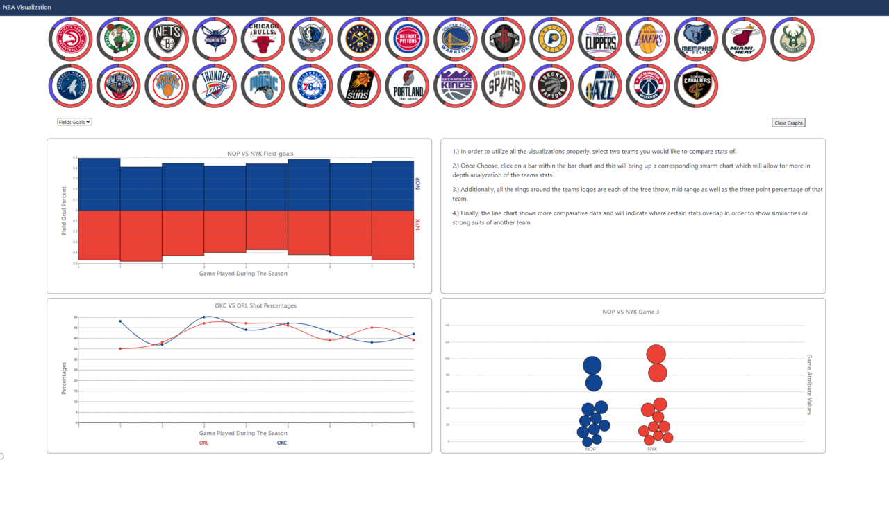
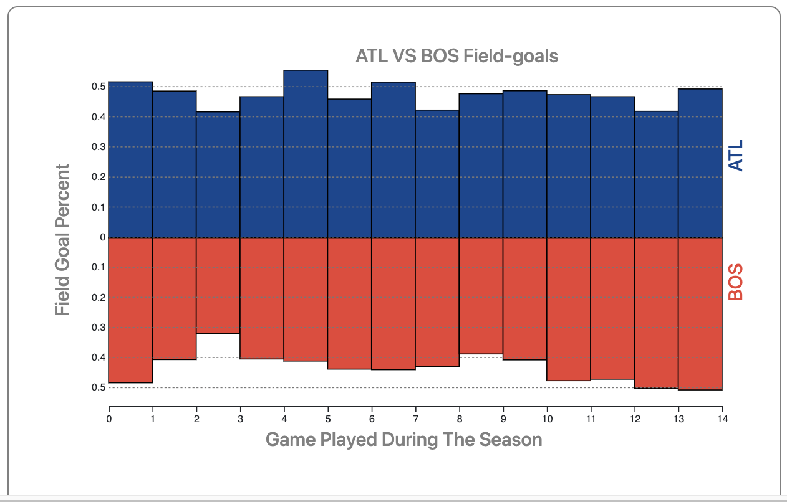
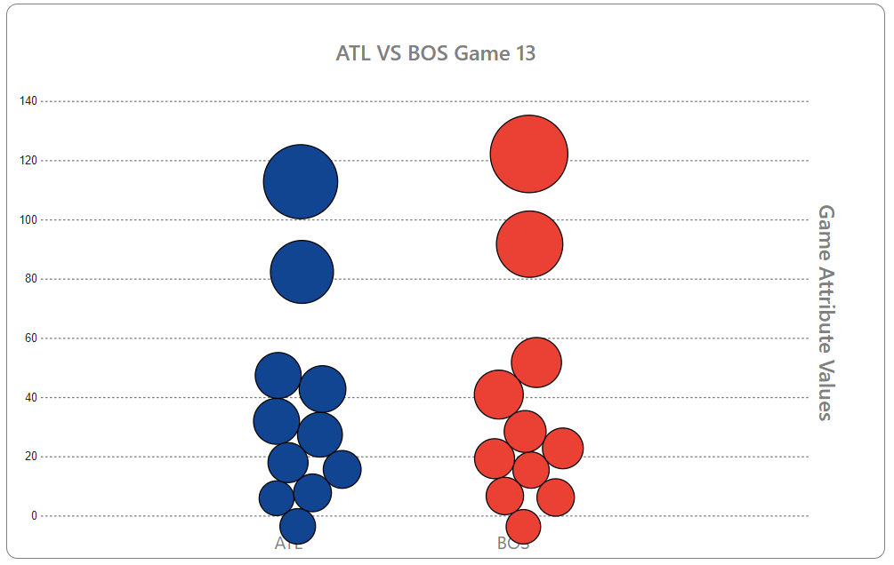
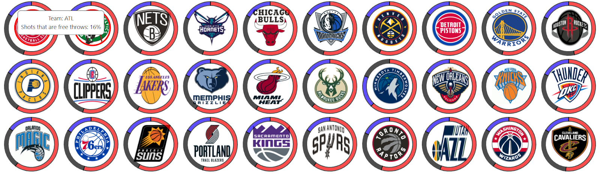
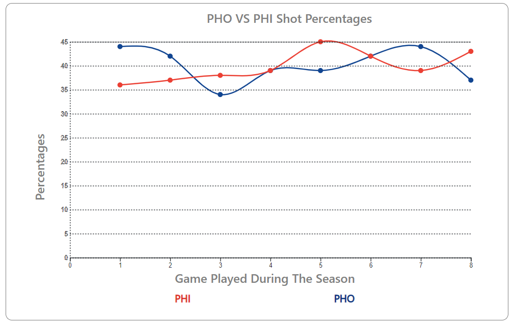

# NBA Visualization Final Project:

## OverView

The main goal of our project is to display various statistics of the teams in the NBA, to people who may be interested in sports betting. Oftentimes, placing bets is based on how well a team has performed in recent history and bets can be placed on anything from the number of rebounds scored for a game to what the final score of the game will be. Through our visualization, users can select teams they want to compare stats from, in the form of a bar chart, a swarm chart, and a line graph. On the team selector, each team has a pie chart around it, which breaks down the percentage of shots that are 3 pointers, field goals, and free throws. When two teams are selected, a bar chart pops up that compares stats between the two selected teams for each of the games they’ve played over the past few seasons. Once the user selects a certain game on the bar chart, a swarm chart pops up with specific statistics about each team from the game. On the pie charts around the team selector, if a user wants to compare the shot breakdown between the two teams, they can click on the respective area on the pie chart and get the line graph of a comparison of that shot type between the two teams selected.

## Data Description

#### Cardinality

The cardinality of the data set is based on a 4 year time frame with each game having 80 games in the season.

#### DataSet

[Kaggle](https://www.kaggle.com/ionaskel/nba-games-stats-from-2014-to-2018)

No Preprocessing of the data was required.

## Goals and Tasks

The intended tasks of our project is to provide statistics for each team in the NBA, in order for sports bettors to check and make the best decisions based on the analysis provided before placing a bet.

## Idioms

From top to bottom, the interface has all 30 NBA teams at the top of the page with their corresponding shot percentage breakdown surrounding it. Immediately under those logos are the 3 other visualizations that we designed. They are meant to encompass the dual-sided bar chart, the swarm chart as well as the line chart.

##### Histogram

- The dual-sided bar chart has the ability to display multiple statistics based on one that is user specified. This choice of visualization was selected in order to compare and contrast the chosen statistic in a vertical analysis comparison.

- The interaction of the dual-sided bar chart came in the form of a drop down that allowed the user to select whatever statistic they wished to analyze.

- The linking of the chart was designed in order to allow a user to select a specific game they thought would show statistical value. Upon selection a corresponding swarm chart would appear in order to give more in depth statistics.

- Aside from basic iteration from 0..n of data sets there were notable algorithms that were used in order to solve this problem.

- The idioms shown can be visualized in terms of the height each of the bars reaches, this displays the efficiency of each statistic chosen by the user.

- You can manipulate the data by selecting a different data set from the specified dropdown.

##### Swarm

- The swarm chart iterates through the data and creates a circle on the chart that represents the value in terms of radius. The larger the circle, the higher the statistic.

- The Graph is drawn using the force algorithm which makes the generated gravity based around their x axis.

- In terms of interactions, my chart allows the user to hover over the circle to get the attribute name and value.

- My chart also interacts with the histogram, so when you are looking at a statistic in the histogram, you can get a more indepth look at the game you are interested in.

- For my graph I had to utilize the force algorithm to have the circle collision and gravity transitions.

##### RadialCircles

- The implemented visualization is a doughnut pie chart and it allows the user to see the shots that are field goals, free throws as well as three points. The encoding choices can be noted by the fact that arcs around each logo the best and it was easily viewable by the user

- The first interaction is a tooltip that shows the acronym for the team that the stat is being displayed for and the percentage of the shot type that the user is hovering over. The second interaction is the users ability to select the type of shot and see a line graph of a comparison of that shot type with the teams selected.

- The views are linked in the selection of the teams, which brings up the bar chart and the selection of the shot types, which brings up a line graph.

- The algorithms used are a simple algorithm to filter the data Used in the visualization.

##### LineChart

- The line chart uses the statistics of two teams’ field goal percentages, 3pt percentages, and free-throw percentages among all the games the teams played each other.

- The implemented features involve user interaction with the pie charts around the teams which generate the line chart.

- The views are linked in the sense that the user selects two stats from two different teams and then that triggers an action to generate the line chart producing the statistical analysis

- There were no algorithms used as the line chart required linear functionality only.

## Reflection

Our first initial work in progress was very rough around the corners, and we didn’t have any sort of graphs yet on our page, all we had was the basic layout of how we wanted the interface to look. Over the last two weeks all members on the team worked hard on their graphs and we all came together this last week to do the final implementations. I would say that we came close to our original planned application with some minor changes.

Over the course of development, the goals did change for some of the members. For example, we were going to implement a swarm chart that would iterate over the current selected teams game, but instead, we found the interactions between the histogram graph and the swarm graph a lot more meaningful when one feeds into another. Overall, I think these changes in goals were for the better as it allowed our visualizations to be more interactive amongst each other.

In terms of how realistic the original goal was, we think more simplified. When we got most of the implementation done for each of the visualizations, we kept brainstorming for more features to add. For example, the histogram was originally only going to display one statistic, but we added many more as well as color coordination in the final implementation.

Over the course of the development we ran into many issues, specifically when we tried to implement the visualization interactions amongst each other. Overall, just the amount of bug fixes and implementation issues we did not fully account for. One feature we tried to implement was having clear selection indicators for the teams. But due to the certain styling of the images and the SVG elements attached to them, made it hard to implement without doing major refactoring. We were able to get around this by just adding a border with a nice color that matches the theme of the project.

The one thing we would do differently, would be better planning on the interactions to lower the amount of bug fixes. Just debugging the code and having to implement workarounds for some of the problems we were having took a majority of the development time. That way it leaves us with more breathing room for another feature implementation.

## Team workload

The work was evenly split among the group members. Each member did one visualization on the project. Gannon worked on the bar chart, Gage worked on the swarm chart, Nikhil worked on the line graph, and Prashant worked on the doughnut pie charts around each team in the team selector. In addition to this, the group met 2-3 times a week for the duration of the project to discuss progress, any roadblocks, and any changes or ideas they wanted to implement to our project. We also stayed in contact with the professor throughout the project to make sure all the requirements were being met.
